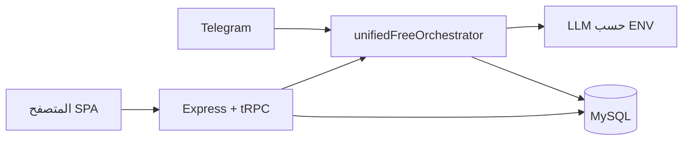

# بنية المشروع (مرجع سريع)

مشروع **chinese-ai-bot-self-learning**: واجهة React + خادم Express + tRPC + MySQL، مع محادثة ذكية، RAG نصي يدوي، وبوت تليجرام اختياري.

**هوية الواجهة:** النصوص الظاهرة للمستخدم تُستورد من `client/src/lib/brand.ts` حيث يلزم توحيد الاسم أو الشعار.

**التنقل:** شريط موحّد `client/src/components/AppToolbar.tsx` يُستخدم في الصفحات الداخلية (لوحة التحكم، المحادثة، الإحصائيات، …) مع تمييز الصفحة الحالية (`aria-current="page"`).

## المكدس

| طبقة      | تقنية                                                                  |
| --------- | ---------------------------------------------------------------------- |
| واجهة     | React, Vite, Wouter, tRPC client                                       |
| API       | tRPC على `/api/trpc`                                                   |
| خادم      | Express, OAuth, rate limit                                             |
| بيانات    | MySQL + Drizzle                                                        |
| منطق الرد | `unifiedFreeOrchestrator` → `taskAnalyzer`, `toolManager`, `invokeLLM` |
| معرفة     | `knowledgeService` + جدول `knowledge_chunks`                           |

## مخطط السياق



## شجرة tRPC (`server/routers.ts`)

- `system` — فحوصات وإعدادات، `llmSummary`، `healthDeep` (مسؤول)
- `bot` — محادثات الويب (`my*`) + مسارات تراثية محمية اختيارياً (`botLegacyProcedure` + `INTERNAL_BOT_API_SECRET`)
- `agent` — مهام الوكلاء
- `models` — قائمة النماذج، أفضل نموذج، توصيات (مع `capabilities` اختياري)، مقارنة، إحصائيات؛ واجهة `/models` تمرّر القدرات كقائمة مفصولة بفاصلة
- `knowledge` — `myList` / `myAdd` / `myDelete` / `myChunkStats`
- `feedback` — `submit` (مستخدم مسجّل)، `listRecent` (مسؤول)
- `auth` — `me`, `logout`

## تدفق محادثة الويب (مبسّط)

```mermaid
sequenceDiagram
  participant UI as Chat.tsx
  participant TRPC as bot.myProcessMessage
  participant DB as MySQL
  participant Orch as unifiedFreeOrchestrator
  participant RAG as knowledgeService
  participant LLM as invokeLLM

  UI->>TRPC: رسالة + tenantId + conversationId?
  TRPC->>DB: محادثة/رسائل
  TRPC->>Orch: execute(..., knowledgePrincipal web)
  Orch->>RAG: استرجاع مقتطفات
  RAG->>DB: knowledge_chunks
  Orch->>LLM: system + user
  LLM-->>Orch: رد
  Orch-->>TRPC: message + metadata
  TRPC-->>UI
```

## خط أنابيب المنسّق (`server/ai/unifiedFreeOrchestrator.ts`)

1. **بوابة عدم الضرر** `noHarmPolicy.tryHarmPolicyGate` — ردّ ثابت آمن دون LLM عند طلبات ضارّة صريحة؛ يُعطّل بـ `NO_HARM_GATE=0` للتطوير فقط.
2. `taskAnalyzer.analyzeTask` — تصنيف المهمة (يستدعي LLM بصيغة JSON).
3. اختيار أداة مجانية (`toolManager`) مع تفضيل من `learningEngine` (شخصي ثم جماعي اختياري).
4. (اختياري) `retrieveKnowledgeForPrompt` + `knowledge_chunks` إن وُجد `knowledgePrincipal`.
5. (اختياري) `codeExecutor` لمهام تنفيذ كود من كتل markdown.
6. `invokeLLM` مع `buildSystemPrompt` (يشمل `NON_MALEFICENCE_SYSTEM_LINES` + مقتطفات المعرفة + سياق التعلّم).
7. (اختياري) جولات **مجلس نماذج** `LLM_COUNCIL_ROUNDS` / `LLM_COUNCIL_MODELS`.
8. عند النجاح: `learningEngine.analyzeTaskOutcome` + `updateModelPerformance` + إشارة `commercialAgentKernel`.

## الخادم HTTP (`server/_core/index.ts`)

- `installCoreHttpGuards` — `X-Request-Id`، رؤوس أمان أساسية.
- ضغط `compression` في الإنتاج (عطّل بـ `COMPRESSION=0`).
- `GET /health` و `/api/health` — JSON + `requestId`؛ 503 إن قاعدة البيانات معرّفة لكن `ping` فاشل.
- tRPC: `onError` يسجّل المسار و`requestId`.
- `createContext` يمرّر `requestId` إلى سياق الإجراءات.

## ضمان الجودة (مراجعة آلية)

- من جذر المشروع: `pnpm run verify` = تنسيق Prettier + `tsc` + `vitest` + بناء Vite + حزمة الخادم.
- CI: `.github/workflows/ci.yml` — مهمة فرعية على هذا المجلد تشغّل `pnpm run verify`.
- ما يتخطّاه الاختبار تلقائياً: `secrets.test.ts` ومجموعات `integration.test.ts` عند غياب أسرار تليغرام/OpenRouter في البيئة — هذا مقصود.

## فهم عميق — حدود ودَين تقني

- **`as any` في الوكلاء** (`agentRouter`, `teamManager`, `specializedAgents`): ميراث مرونة الأنواع؛ لا يعطل البناء؛ يُفضّل تضييق الأنواع تدريجياً.
- **تعلّم جماعي**: جدول `collective_pattern_stats`؛ عطّل بـ `COLLECTIVE_LEARNING=0` إن لم تُرِد تجميعاً عبر المستخدمين.
- **RAG**: تطابق كلمات مُطبَّع + **MMR** لتقليل تكرار المقتطفات (ليست متجهات)؛ مناسب لمعرفة يدوية صغيرة؛ لتوسيع الجودة لاحقاً: تضمينات.
- **الأمان**: الإنتاج يحتاج `JWT_SECRET`، ويُنصح `INTERNAL_BOT_API_SECRET` و`TRUST_PROXY=1` خلف الوكيل؛ راجع `docs/DEPLOY_DOMAIN_AR.md`.

## مجلدات رئيسية للتعديل

| مسار                                       | متى تعدّل                                          |
| ------------------------------------------ | -------------------------------------------------- |
| `server/ai/unifiedFreeOrchestrator.ts`     | سلوك الرد، خطوات ما قبل LLM                        |
| `server/ai/knowledgeService.ts`            | استرجاع المعرفة (تطابق كلمات + MMR لتقليل التكرار) |
| `server/routers/botRouter.ts`              | حفظ المحادثة، حدود الرسائل                         |
| `server/telegram/botHandler.ts`            | تليجرام                                            |
| `drizzle/schema.ts`                        | نموذج البيانات                                     |
| `client/src/pages/`                        | الواجهات                                           |
| `server/platform/commercialAgentKernel.ts` | فوترة / مصادر معرفة مستقبلية                       |

## تجربة المستخدم (واجهة)

- **لوحة التحكم**: تنبيهات toast لأخطاء الاستعلامات الرئيسية؛ نجاح/فشل واضح لاختبار `llmProbe`.
- **المحادثة**: toast عند فشل تحميل المحادثات أو الرسائل أو إرسال رسالة.
- **404**: صفحة عربية بثيم داكن متسق مع التطبيق.

## وثائق ذات صلة

- [COMMERCIAL_AGENT_ROADMAP_AR.md](./COMMERCIAL_AGENT_ROADMAP_AR.md)
- [PHASES_SIMPLE_AR.md](./PHASES_SIMPLE_AR.md)
- [IP_AND_LEGAL_AR.md](./IP_AND_LEGAL_AR.md) — ملكية فكرية واستخدام قانوني (إرشاد)
- [BETA_LAUNCH_AR.md](./BETA_LAUNCH_AR.md) — إطلاق تجريبي للمقربين
- [LICENSE](../LICENSE) — رخصة مشروعك (MIT)
- [THIRD_PARTY_NOTICES.md](../THIRD_PARTY_NOTICES.md) — ملخص رخص الاعتماديات وإرشادات الامتثال
