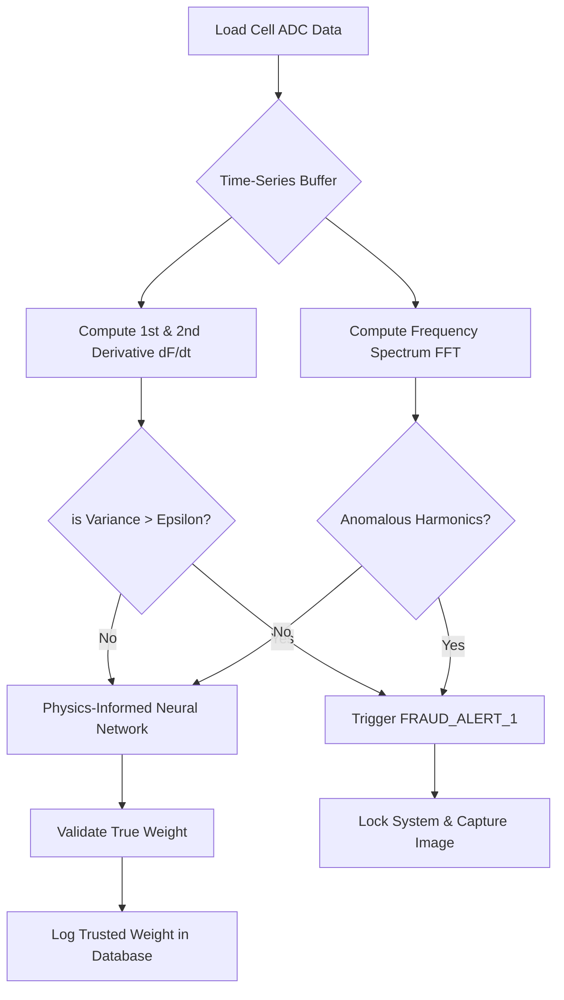

# Mathematical Derivation: "Anti-Fraud" Algorithm for Industrial Scales
**Version 1.0 - Proprietary Asset for Rafid SmartBridge**

## 1. Abstract
Fraud in industrial truck scales usually occurs through:
1. **Dynamic manipulation:** Suddenly applying force during the stabilization phase.
2. **Electronic tampering:** Splicing the load cell cable with a variable resistor to spoof the microvolt $(\mu V)$ signature.
3. **Positioning fraud:** Placing the truck partially off the weighing bridge.

To formulate a 100% mathematically proven anti-fraud system, we rely on **Kinematic Time-Series Calculus** and **Wheatstone Bridge Electrical Invariants**.

## 2. Mathematical Derivation of Dynamic Tampering (Anomaly Detection)
A legitimate weighing event follows an underdamped harmonic oscillator model until stabilization. 
The force $F(t)$ read by the load cell over time $t$ should satisfy:
$$ F(t) = W + A e^{-\zeta \omega_n t} \cos(\omega_d t + \phi) $$
Where:
- $W$: The true static weight.
- $A$: Initial impact amplitude.
- $\zeta$: Damping ratio of the scale deck.
- $\omega_n, \omega_d$: Natural and damped frequencies.

### 2.1 First and Second Derivatives
To detect human or mechanical interference (e.g., someone jumping on the scale or adding weight gradually), we evaluate the rate of change $\frac{dF}{dt}$ and acceleration $\frac{d^2F}{dt^2}$.

$$ F'(t) = -A e^{-\zeta \omega_n t} [ \zeta \omega_n \cos(\omega_d t + \phi) + \omega_d \sin(\omega_d t + \phi) ] $$

**The Anti-Fraud Axiom:**
If the variance of $\frac{d^2F}{dt^2}$ exceeds the known noise floor boundary $\sigma_{noise}^2$ during the supposedly "Stable" window ($t > T_{stable}$), a fraud flag is raised.
$$ \text{Fraud IF } \int_{T_1}^{T_2} \left| \frac{d^2F}{dt^2} \right| dt > \epsilon_{threshold} $$

## 3. Electronic Spoofing (Wheatstone Bridge Resistance Check)
For analog load cells (like Zemic HM9B), a fraudster might add a parallel resistor $R_{fraud}$.
The excitation voltage $V_{ex}$ and signal voltage $V_{sig}$ are linked by:
$$ V_{sig} = V_{ex} \left( \frac{R_1}{R_1+R_2} - \frac{R_3}{R_3+R_4} \right) $$

By injecting a high-frequency micro-pulse into the $V_{ex}$ line, if $R_{fraud}$ is present, the RC time constant $\tau$ of the cable changes drastically. 
$$ \tau_{measured} \neq \tau_{baseline} \implies \text{Hardware Tampering Detected} $$

## 4. Architectural Schema

## 5. Conclusion
By embedding this numerical integration and differentiation logic into the Delphi/N8N core, the system shifts from relying on a simple "Stable" flag (easily tricked) to a **Kinematic and Electrical Invariant Proof**.
